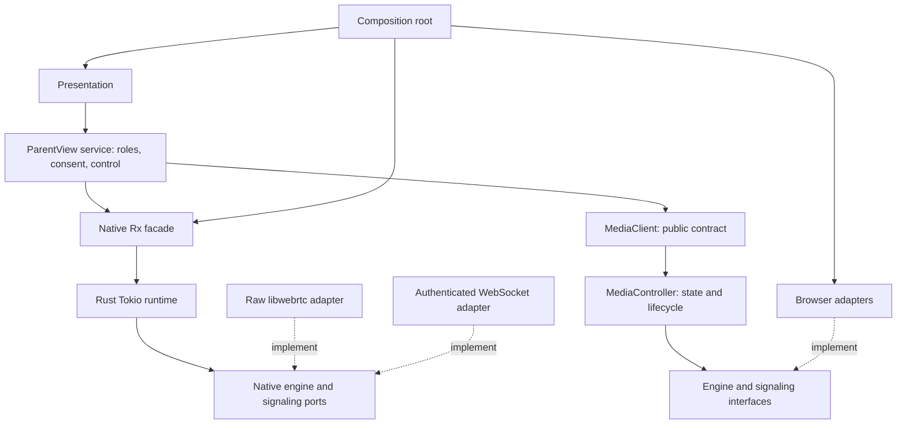

# Architecture and ownership

The media SDK is a reusable, role-neutral product. ParentView is one consumer. A peer is a transport participant, a source is a camera/screen/microphone track, and a data channel carries application data. Neither a peer nor a source has a parent/child role.

## Dependency direction

The Tokio signaling service is an independent authenticated rendezvous service. coturn relays encrypted WebRTC packets; it does not own rooms or product roles.

## Module contracts

| Module | Responsibility | Non-responsibility | State/resources | Dependencies | Teardown |
| --- | --- | --- | --- | --- | --- |
| SDK core | Peer lifecycle, mesh coordination, media events | UI, roles, concrete engines | Session generation, peers, owned tracks, Rx subscriptions | RxJS, own ports/types | Leave closes all peers and capture; destroy completes streams |
| Browser adapter | RTCPeerConnection, capture and WebSocket IO | Product policy | Native browser handles, listeners | Browser APIs and SDK ports | Close PC/socket; remove listeners; abort pending work |
| Native Rx facade | Validate/project authoritative snapshots; expose readonly streams and commands | Session state machine, negotiation, Tauri APIs | One event pump, subscribers | RxJS, injected transport | Cancel pending consumers, await transport destroy, complete streams |
| Rust media runtime | Authoritative native membership, negotiation, queues and lifecycle | Concrete IO, product roles | Tokio actor, generation, peer resources | Own engine/signaling ports | Interrupt pending work; close every peer/socket; join owned tasks |
| Raw libwebrtc adapter | Native PC/data-channel handles and callback conversion | Rooms, admission, parent/child policy | Engine factory, channels and callback registrations | Raw libwebrtc and runtime ports | Unregister callbacks before closing handles; factory released last |
| Native composition | Construct engine/runtime and authenticated WebSocket signaling | Product authorization or UI state | Socket reader/writer tasks | Runtime, engine adapter, WebSocket library | Cancel tasks and await completion |
| ParentView service | Local role, explicit consent and exclusive control grant | Wire protocol and actual OS input | Help-session state and consent | Narrow media/input ports, RxJS | End revokes grants and releases session resources |
| Network service | Environment network observations | Declaring a peer connected | Environment listeners | Environment port | Remove listeners and complete streams |
| Device service | Device catalog and capabilities | Family members/relationships | Device snapshots and refresh work | Device catalog port | Cancel/ignore pending refresh and remove listeners |
| Signaling server | Device credentials, bounded rooms, membership and signal routing | Media packets, roles, capture | Expiring credentials/rooms, per-socket membership | Tokio, Axum | Disconnect removes member and notifies remaining peers |
| Desktop host | Tauri lifecycle, capability report and window/document-owned IPC handles | Product authorization or invented media availability | App lifetime | Tauri, platform APIs | Native tasks stopped with host |

## State and trust

Only the actual media controller owns media state. In the browser laboratory this is TypeScript; the Rust native runtime owns native data-session state and exposes a TS facade. These implementations are alternatives, never two concurrent authorities for the same session.

Device token authenticates an installation. A room invitation secret admits that device into a media room. Media-room admission does not grant remote-input authority. ParentView consent/control grants are checked separately at the receiving service. An incoming data message must never directly invoke native input.

ParentView exposes `parent` and `child` explicitly in the service domain. SDK functionality is capability-based: publication, subscription, capture, transport, statistics. ParentView policies compose these features without inheritance from role-specific SDK clients.

## Delivery sequence

1. Repository, boundaries, contracts, role-neutral browser mesh, authenticated Tokio signaling, TURN configuration and product service tests.
2. Native data transport on macOS (current slice), followed by OS capture/render adapters and validation on every target. Raw frames remain native.
3. Persistent authenticated device pairing, product approval UI, push lifecycle, OS remote-input adapters and exclusive control grants.
4. Cross-device performance, forced relay, network transition, permission-revocation and repeated-lifecycle acceptance tests.

Initial laboratory verification does not substitute for steps 2–4. Native capture, mobile delivery and remote control remain explicit unfinished work until verified.

## Native data slice

The native SDK has three crates: `pv-media-runtime` depends on injected ports, `pv-media-libwebrtc` implements the engine, and `pv-media-native` composes the engine with WebSocket signaling. Cargo metadata tests enforce production/build dependency allowlists, including renamed and target-specific dependencies. The DOM-free `@parentview/media-sdk/native` entry depends only on its own contracts and RxJS; Tauri invoke is injected by the desktop app.

Membership and channel readiness are distinct snapshots. The lexicographically smaller server-authenticated peer ID creates the ordered data channel and offer. Native snapshots carry monotonic revisions; stale callbacks are generation-filtered and late JS completions cannot restore an old session. Send results mean local engine acceptance, not application delivery. Public messages are bounded UTF-8 strings; errors contain stable codes and safe messages. No SDP, ICE or raw media API is exposed to the service layer.

The data-only native path currently has no publication/capture/render operations. `nativeDataChannels` is macOS-gated; `nativeMedia` and `remoteInput` remain false. See [native engine build and limits](../crates/media-native/README.md).
